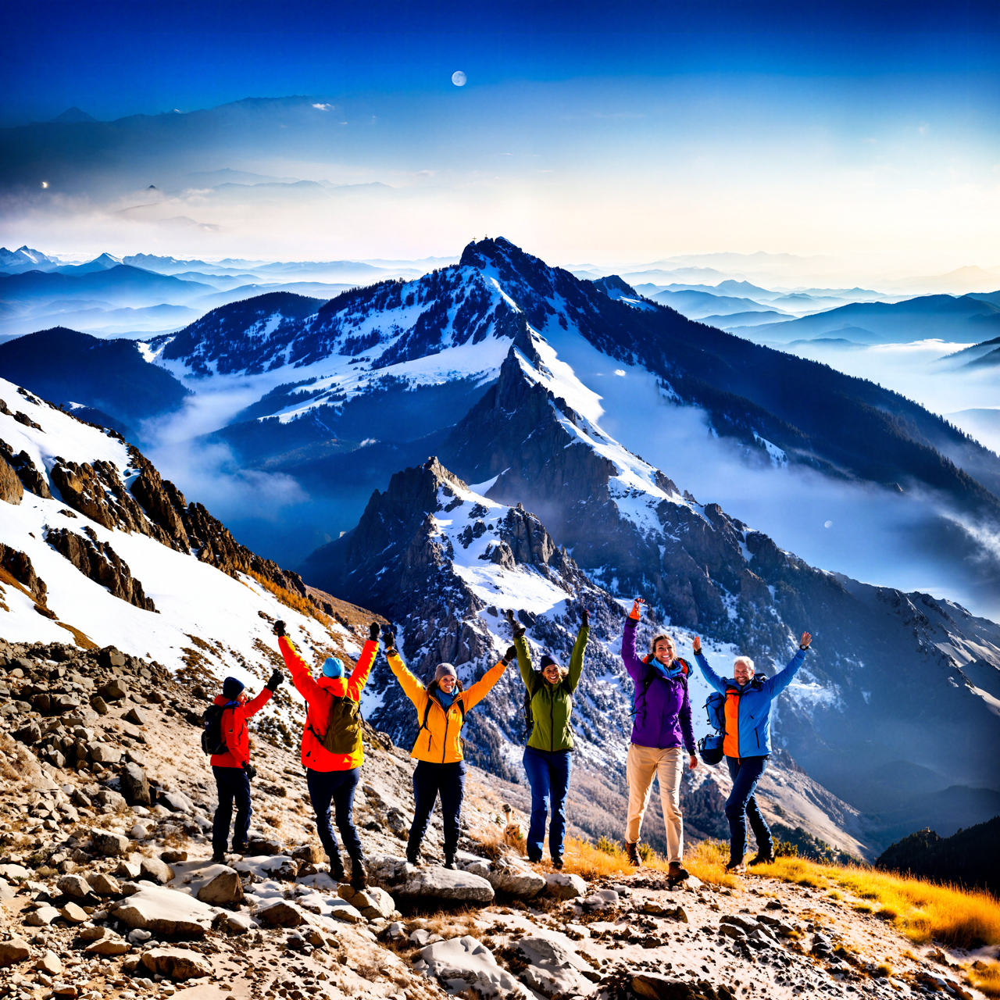

## [ECCV 2024] BeyondScene: Higher-Resolution Human-Centric Scene Generation With Pretrained Diffusion 

  

  

 

> **BeyondScene: Higher-Resolution Human-Centric Scene Generation With Pretrained Diffusion** 
> [Gwanghyun Kim](https://gwang-kim.github.io/)$^{1,* }$, [Hayeon Kim](https://github.com/janeyeon)$^{1,* }$, [Hoigi Seo](https://github.com/seohoiki3215)$^{1,* }$, [Dongun Kang](https://github.com/qkrtnskfk23)$^{1,* }$, [Se Young Chun](https://icl.snu.ac.kr/pi)$^{1,2,\dagger}$  
> $^{* }$ These authors contributed equally to this work., $^{\dagger}$ Corresponding author.
> 
> 
>**Abstract**:  
Generating higher-resolution human-centric scenes with details and controls remains a challenge for existing text-to-image diffusion models. This challenge stems from limited training image size, text encoder capacity (limited tokens), and the inherent difficulty of generating complex scenes involving multiple humans. While current methods attempted to address training size limit only, they often yielded human-centric scenes with severe artifacts. We propose BeyondScene, a novel framework that overcomes prior limitations, generating exquisite higher-resolution (over 8K) human-centric scenes with exceptional text-image correspondence and naturalness using existing pretrained diffusion models. BeyondScene employs a staged and hierarchical approach to initially generate a detailed base image focusing on crucial elements in instance creation for multiple humans and detailed descriptions beyond token limit of diffusion model, and then to seamlessly convert the base image to a higher-resolution output, exceeding training image size and incorporating details aware of text and instances via our novel instance-aware hierarchical enlargement process that consists of our proposed high-frequency injected forward diffusion and adaptive joint diffusion. BeyondScene surpasses existing methods in terms of correspondence with detailed text descriptions and naturalness, paving the way for advanced applications in higher-resolution human-centric scene creation beyond the capacity of pretrained diffusion models without costly retraining.

## Notice 
- [Jul. 2024] BeyondScene is accepted to ECCV 2024🥳. See you in Milano 🇮🇹🍝🍕🏰.
- The code is comming soon!
